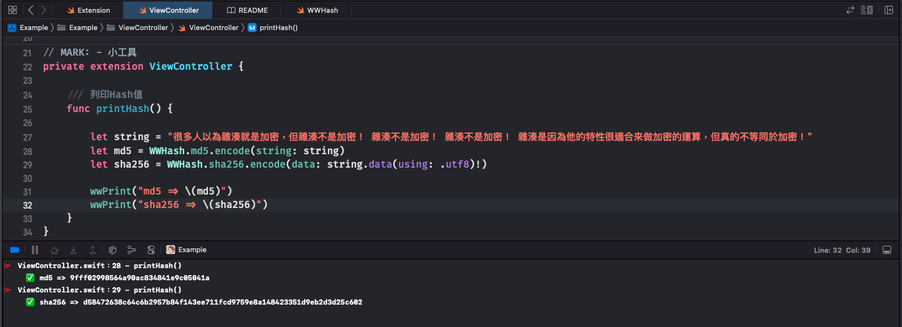

# WWHash

[](https://developer.apple.com/swift/) [](https://developer.apple.com/swift/)  [](https://developer.apple.com/swift/) [](https://developer.apple.com/swift/)

## [Introduction - 簡介](https://swiftpackageindex.com/William-Weng)
- A small tool for calculating Hash values.
- 計算Hash值的小工具。

## [Achievements display - 成果展示](https://www.hkweb.com.hk/blog/ui設計基礎知識：引導頁對ui設計到底有什麼作用/)


## [Installation with Swift Package Manager - 安裝方式](https://medium.com/彼得潘的-swift-ios-app-開發問題解答集/使用-spm-安裝第三方套件-xcode-11-新功能-2c4ffcf85b4b)

```bash
dependencies: [
    .package(url: "https://github.com/William-Weng/WWHash.git", .upToNextMajor(from: "1.0.0"))
]
```

## Function - 可用函式

|函式|功能|
|-|-|
|encode(string:)|將文字轉成hash值|
|encode(data:)|將資料轉成hash值|

## Example - 程式範例
```swift
import UIKit
import WWPrint
import WWHash

// MARK: - Hash範例
final class ViewController: UIViewController {

    override func viewDidLoad() {
        super.viewDidLoad()
        printHash()
    }
}

// MARK: - 小工具
private extension ViewController {
    
    /// 列印Hash值
    func printHash() {
        
        let string = "很多人以為雜湊就是加密，但雜湊不是加密！ 雜湊不是加密！ 雜湊不是加密！ 雜湊是因為他的特性很適合來做加密的運算，但真的不等同於加密！"
        let md5 = WWHash.md5.encode(string: string)
        let sha256 = WWHash.sha256.encode(data: string.data(using: .utf8)!)
        
        wwPrint("md5 => \(md5)")
        wwPrint("sha256 => \(sha256)")
    }
}

```
